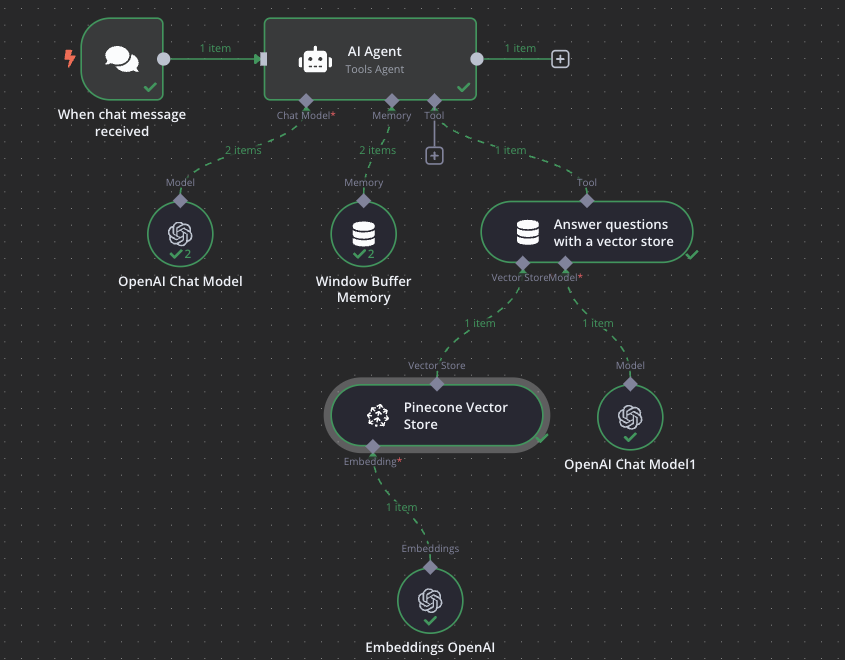

# 🤖 Creación de un Agente con RAG en n8n — Guía Paso a Paso

Este documento explica **cómo crear un agente con RAG (Retrieval-Augmented Generation)** en n8n, basado en el diagrama de flujo mostrado en la imagen de referencia. Incluye la función de cada nodo, cómo configurarlo y cómo se conecta en el flujo.

## 📌 Objetivo
Construir un agente que:
1. Reciba mensajes de un chat.
2. Pueda razonar y decidir cuándo buscar información en una base vectorial (Pinecone).
3. Genere respuestas basadas en datos reales usando RAG.

---

## 🛠 Estructura del flujo

### **1. Nodo de disparo (Trigger)**
- **Nombre:** `When chat message received`
- **Función:** Captura los mensajes que envía el usuario desde un canal como Telegram, Slack o un chat web.
- **Salida:** Texto del usuario (`query`), que será la base para todo el proceso.

---

### **2. Nodo `AI Agent` (Tools Agent)**
- **Función:** Nodo principal que orquesta la conversación.
- **Recibe:**
  - Modelo de chat para procesar y razonar (`OpenAI Chat Model`).
  - Memoria de la conversación (`Window Buffer Memory`).
  - Herramientas adicionales como la búsqueda en un vector store.
- **Configuración:**
  - Tipo de agente: **Tools Agent**.
  - Instrucciones del rol: Indicar que debe usar el vector store para buscar información relevante antes de responder.
- **Conexiones:**
  - Entrada: desde el **Trigger**.
  - Salidas: hacia nodos de modelo, memoria y herramientas.

---

### **3. Nodo `OpenAI Chat Model` (vinculado al AI Agent)**
- **Función:** Define el modelo LLM principal que usará el agente para interpretar y razonar.
- **Ejemplo de configuración:**
  - Modelo: `gpt-4o-mini` o `gpt-4`.
  - Temperatura: baja (0.2–0.3) para respuestas precisas.
- **Conexión:** Desde el `AI Agent` (como **Chat Model**).

---

### **4. Nodo `Window Buffer Memory`**
- **Función:** Mantiene un historial limitado de mensajes para dar contexto.
- **Ejemplo:**
  - Guardar las últimas 5–10 interacciones.
- **Conexión:** Desde el `AI Agent` (como **Memory**).

---

### **5. Nodo `Answer questions with a vector store`**
- **Función:** Herramienta que conecta el agente con la base de conocimiento vía RAG.
- **Acción:** Recibe la consulta del usuario y busca información relevante en la base vectorial antes de responder.
- **Conexiones:**
  - **VectorStoreModel:** conectado a un modelo de chat (`OpenAI Chat Model1`).
  - **Vector Store:** conectado a `Pinecone Vector Store`.

---

### **6. Nodo `Pinecone Vector Store`**
- **Función:** Base de datos vectorial que almacena los embeddings de tus documentos.
- **Flujo:**
  1. Recibe la consulta en forma de vector.
  2. Busca coincidencias más cercanas (top-k).
  3. Devuelve fragmentos relevantes como contexto.
- **Conexión:**
  - Entrada **Embedding**: desde `Embeddings OpenAI`.
  - Salida **Vector Store**: hacia `Answer questions with a vector store`.

---

### **7. Nodo `Embeddings OpenAI`**
- **Función:** Convierte el texto en un vector numérico (embedding) para buscar en Pinecone.
- **Modelo recomendado:** `text-embedding-3-small` (rápido y económico) o `text-embedding-3-large` (más preciso).
- **Conexión:**
  - Entrada: texto de la consulta (pasado por la herramienta).
  - Salida: vector hacia `Pinecone Vector Store`.

---

### **8. Nodo `OpenAI Chat Model1` (VectorStoreModel)**
- **Función:** LLM que se usa dentro de la herramienta RAG para generar la respuesta usando el contexto recuperado.
- **Diferencia con el primer modelo de chat:**
  - El primer `OpenAI Chat Model` es para el agente general.
  - Este segundo modelo se usa exclusivamente cuando el agente decide consultar el vector store.

---

## 🔄 Flujo de ejecución completo
1. Usuario envía un mensaje → `When chat message received`.
2. El mensaje llega al **AI Agent**.
3. El agente:
   - Usa su modelo principal (`OpenAI Chat Model`) para razonar.
   - Consulta la memoria (`Window Buffer Memory`) para mantener el contexto.
   - Decide usar la herramienta RAG (`Answer questions with a vector store`).
4. La herramienta RAG:
   1. Convierte la consulta en embedding (`Embeddings OpenAI`).
   2. Busca en la base vectorial (`Pinecone Vector Store`).
   3. Pasa los fragmentos relevantes a `OpenAI Chat Model1`.
5. El modelo genera una respuesta usando solo la información recuperada.
6. El agente envía la respuesta al usuario.

El flujo debería lucir así:

---

## 💡 Consejos
- Ajusta `topK` en Pinecone para mejorar la cantidad de contexto (3–8 recomendado).
- Usa `temperature` baja para evitar respuestas inventadas.
- Mantén los datos de Pinecone actualizados para asegurar respuestas precisas.

---

## 📎 Recursos
- [n8n Documentation](https://docs.n8n.io)
- [Pinecone Documentation](https://docs.pinecone.io)
- [OpenAI API Docs](https://platform.openai.com/docs)

---

[⬅ Back to Course Overview](../../README.md)
