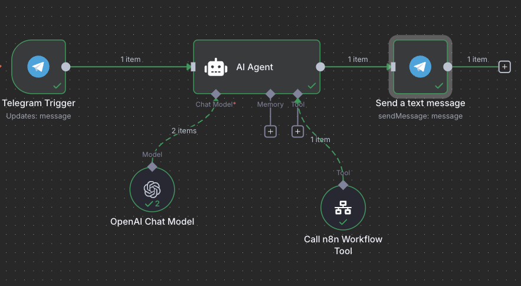
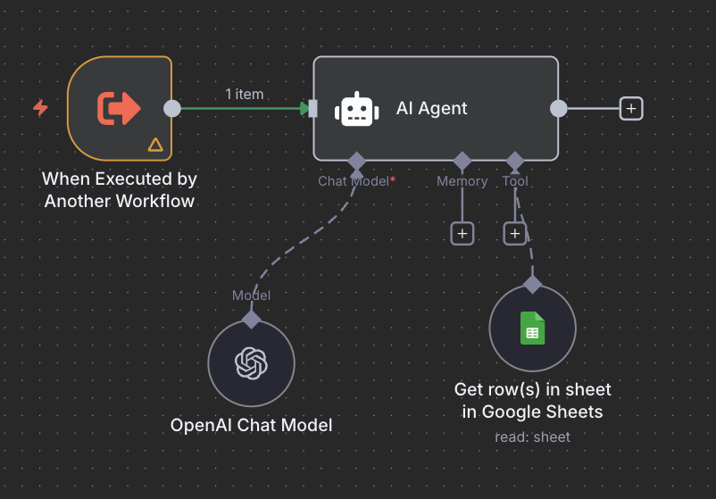

# 🧪 Lab — Master Agent + Subworkflow CRM Lookup

### 🎯 Objective
Create an **orchestrated agent system** in n8n where:  
- The **Main Workflow (Coordinator)** receives a user request.  
- If it’s a **customer info request**, it calls the **CRM Lookup Subworkflow**.  
- The **Subworkflow** returns customer data from the CRM (Google Sheets or mock data).  
- The **Main Workflow** then outputs:  
  - The raw JSON.  
  - An **enriched text summary**.  

## Resources

- Coordinator Workflow: [Link](./G_CRM.json)
- Subworkflow (CRM Lookup): [Link](./Sub_WF_CRM.json)

## 🔹 Step 1 — Prepare CRM Data
1. Copy the CRM dataset from this [Google Sheet](https://docs.google.com/spreadsheets/d/1CZV1sn9sUM8SDVUcAwoOD3g3dceTavxdP8eEiKJNoDc/edit?usp=sharing).  


## 🔹 Step 2 — Create the Subworkflow (CRM Lookup)

**Workflow name:** `CRM Lookup`  

1. **Trigger**: Use **Webhook Trigger** (or “Execute Workflow” if called internally).  
   - Input parameter: `query` (can be CustomerID, Email, or Name).  

2. **Google Sheets Node (Lookup Row)**  
   - Sheet: CRM data.  
   - Search column: Email (you can extend to Name or ID).  
   - Return the matching row.  

3. **Set Node**  
   - Map fields into strict JSON with the structure:  
     ```json
     {
       "CustomerID": "",
       "Name": "",
       "Email": "",
       "Phone": "",
       "City": "",
       "Status": "",
       "Plan": "",
       "TotalSpentUSD": ""
     }
     ```  

4. **Respond to Webhook**  
   - Return the JSON object.  

✅ At this point, if you call the subworkflow with `alice@mail.com`, it should return the customer’s record in JSON.  


## 🔹 Step 3 — Create the Main Workflow (Coordinator)

**Workflow name:** `Coordinator Agent`  

1. **Trigger**: Webhook Trigger — receives user messages.  

2. **AI Node (OpenAI Chat)**  
   - Role: System prompt (Coordinator).  
   - Prompt instructs the agent to:  
     - If request is about a customer → call the `CRM Lookup` subworkflow.  
     - If not → return `{"action":"unsupported"}`.  

3. **Execute Workflow Node**  
   - Call the `CRM Lookup` subworkflow.  
   - Pass `query` (from user input).  

4. **If Node**  
   - If response is valid JSON → continue.  
   - Else → return unsupported.  

5. **Function Node (Parse JSON + Enrich)**  
   - Parse the subworkflow’s JSON.  
   - Build enriched summary text, e.g.:  
     ```
     Customer Alice Johnson (ID: CUST001) from New York is currently Active on the Premium plan.
     Contact: alice@mail.com, Phone: 555-1001. Total spent: $1200.50.
     ```  

6. **Respond to Webhook**  
   - Return **two outputs**:  
     - `raw_json` → exact JSON.  
     - `summary` → enriched text.  


## 🔹 Step 4 — Test the Lab

- Input:  
  `Show me information for alice@mail.com`  

- Subworkflow Output (raw):  
  ```json
  {"CustomerID":"CUST001","Name":"Alice Johnson","Email":"alice@mail.com","Phone":"555-1001","City":"New York","Status":"Active","Plan":"Premium","TotalSpentUSD":"1200.50"}
  ```  

- Main Workflow Output (final):  
  ```
  raw_json: {"CustomerID":"CUST001","Name":"Alice Johnson","Email":"alice@mail.com","Phone":"555-1001","City":"New York","Status":"Active","Plan":"Premium","TotalSpentUSD":"1200.50"}
  summary: Customer Alice Johnson (ID: CUST001) from New York is currently Active on the Premium plan. Contact: alice@mail.com, Phone: 555-1001. Total spent: $1200.50.
  ```  

---

## ✅ End Result
You now have an orchestrated **Coordinator Agent** that routes requests, calls the **CRM Lookup Subworkflow**, and outputs both **machine-readable JSON** and a **human-friendly summary**.  

### Main Workflow (Coordinator)


### Subworkflow (CRM Lookup)


---

[⬅ Back to Course Overview](../../README.md)


